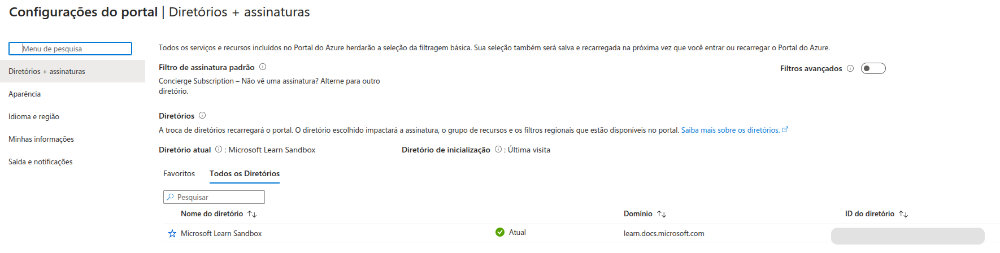
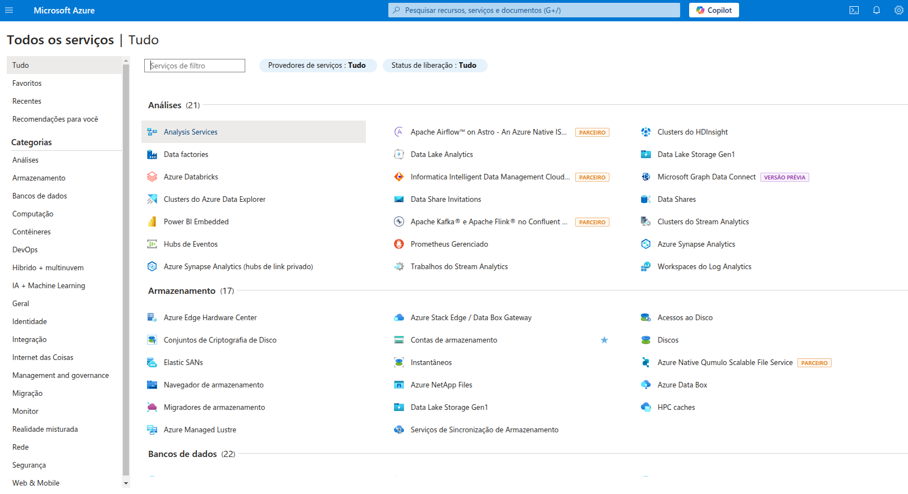

# Microsoft-Azure - Localização de serviços por categoria

  Por meio do laboratório “Localizando Serviços por Categorias”, do curso “Bradesco - Java Cloud Native” da DIO, no módulo de Cloud, é possível compreender os principais aspectos da interface de utilização do Microsoft Azure e os serviços disponibilizados.
  
  Em um primeiro momento, é útil verificar o painel de configurações do Microsoft Azure, que possibilita a configuração de idioma e região, aparência da plataforma, diretórios e assinaturas, notificações, além do acesso às informações da própria conta.

  

  Posteriormente, é necessário conhecer os serviços oferecidos na plataforma e como estão organizados, por meio das seguintes categorias: Análises, Armazenamento, Banco de Dados, Computação, Contêineres, DevOps, Híbrido + Multinuvem, IA + Machine Learning, Geral, Identidade, Integração, Internet das Coisas, Gestão e Governança, Migração, Monitoramento, Realidade Misturada, Rede, Segurança, Web e Mobile. Destaca-se, ainda, a diferenciação em relação aos serviços marcados com a indicação “versão prévia” e as precauções necessárias para seu uso, uma vez que não estão totalmente finalizados e podem ser removidos.

